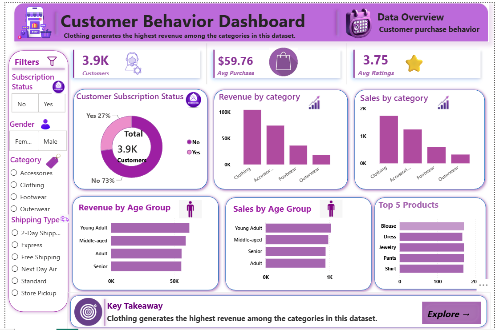

# Customer Shopping Behavior Analysis

## Project Overview

This project analyzes customer shopping behavior using Python, SQL Server, and Power BI.

The objective is to clean and transform customer transaction data, perform SQL-based analysis, and build an interactive Power BI dashboard to understand purchasing patterns, customer segments, product performance, and subscription behavior.

## Dataset

The dataset contains 3,900 customer purchase records with information such as:

- Customer demographics
- Purchased products
- Product categories
- Purchase amount
- Review ratings
- Subscription status
- Shipping type
- Discount usage
- Previous purchases
- Payment method
- Purchase frequency

## Tools & Technologies

- Python
- Pandas
- SQL Server
- SQL
- Power BI
- Git
- GitHub

## Python Data Cleaning

The dataset was cleaned and prepared using Pandas.

### Data Cleaning Steps

- Inspected the dataset and data types
- Checked missing values
- Filled missing review ratings using category-level median values
- Standardized column names
- Renamed the purchase amount column
- Created customer age groups
- Converted purchase frequency into number of days
- Compared discount and promo-code information
- Identified redundant information between discount and promo-code fields
- Removed the redundant `promo_code_used` column
- Performed final data-quality validation

### Final Dataset

- **Rows:** 3,900
- **Columns:** 19
- **Missing Values:** 0

## SQL Analysis

SQL Server was used to analyze customer purchasing behavior and answer business-related questions.

### Analysis Performed

1. Revenue generated by male and female customers
2. Customers who used discounts but spent above the average purchase amount
3. Top 5 products by average review rating
4. Average purchase amount by shipping type
5. Subscriber vs non-subscriber spending
6. Products with the highest percentage of discounted purchases
7. Customer segmentation into New, Returning, and Loyal customers
8. Top 3 most purchased products within each category
9. Repeat buyers and subscription status
10. Revenue contribution by age group

## Power BI Dashboard

The Power BI dashboard provides an interactive view of customer shopping behavior.

### Dashboard Features

- Total customers
- Average purchase amount
- Average review rating
- Customer subscription status
- Revenue by category
- Sales by category
- Revenue by age group
- Sales by age group
- Top 5 products
- Subscription status filter
- Gender filter
- Category filter
- Shipping type filter

## Key Insights

- Clothing generates the highest revenue among the categories in this dataset.
- The dataset contains 3,900 customer purchase records.
- The average purchase amount is approximately **$59.76**.
- The average review rating is approximately **3.75**.
- Subscription customers represent approximately **27%** of the dataset.
- Blouse, Pants, Jewelry, Shirt, and Dress are among the most frequently purchased products.

## Dashboard Preview



## Project Structure

```text
customer-shopping-behavior-analysis/
│
├── data/
│   └── Customer_details_dataset.csv
│
├── images/
│   └── customer_behavior_dashboard.png
│
├── powerbi/
│   └── Customer_Behavior_Dashboard.pbix
│
├── python/
│   └── customer_behavior_analysis.py
│
├── sql/
│   └── customer_behavior_analysis.sql
│
└── README.md
```

## Data Analytics Workflow

The project follows an end-to-end data analytics workflow:

```text
Raw Dataset
     ↓
Data Inspection
     ↓
Python Data Cleaning
     ↓
Data Transformation
     ↓
SQL Server Analysis
     ↓
Power BI Visualization
     ↓
Business Insights
```

## Learning Outcome

Through this project, I practiced the complete data analytics workflow and strengthened my skills in:

- Python
- Pandas
- Data Cleaning
- Data Transformation
- SQL
- SQL Server
- Power BI
- Data Visualization
- Business Analysis
- Dashboard Development

## Note

This is a learning and portfolio project based on a customer shopping behavior dataset. It was created to practice and understand the end-to-end data analytics process.
